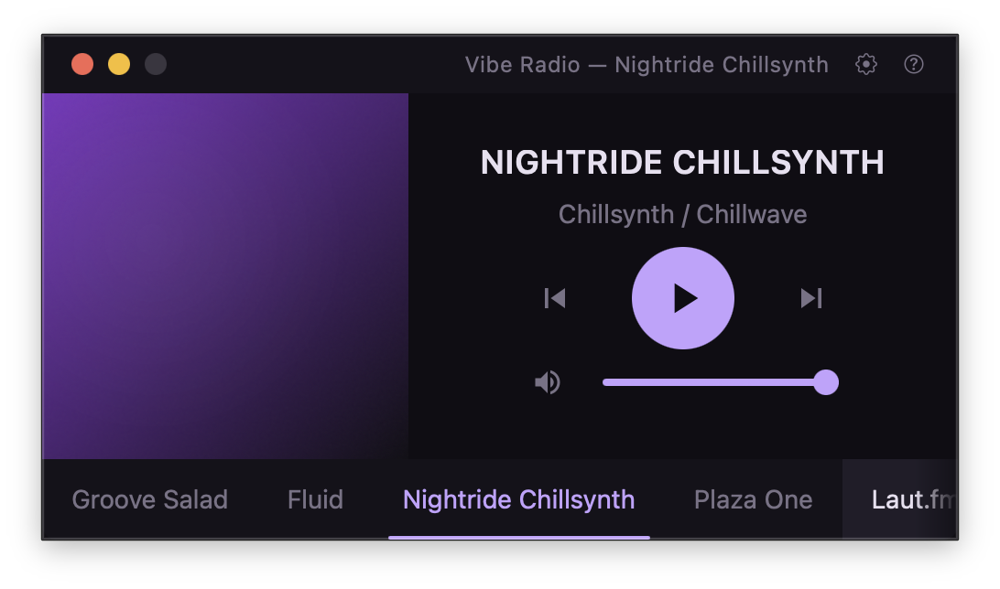

# Vibe Radio

**The lofi radio app your desk deserves.**



Eight hand-picked stations. One tiny window. No accounts, no ads, no algorithm just put something on and get to work.

[**Download for macOS →**](../../releases)

---

## Why Vibe Radio

Most music apps want to be your whole personality. Vibe Radio just wants to play something nice while you work.

It lives in a small, frameless window in the corner of your screen. It remembers your volume. It responds to your media keys. It gets out of the way.

Built with a native Rust audio engine instead of shipping a second browser, so it's fast to launch, light on memory, and doesn't drain your battery just to stream so Lofi.

---

## Stations

| | Station | Vibe |
|---|---------|-------|
| 🌿 | Groove Salad | Ambient / Downtempo |
| 🎷 | Fluid | Instrumental Hip Hop / Future Soul |
| 🌙 | Nightride Chillsynth | Chillsynth / Chillwave |
| 🌸 | Plaza One | Vaporwave / Chill |
| ☕ | Laut.fm Lofi | Lo-Fi Hip Hop |
| 🎧 | Laut.fm Chilled Beats | Lo-Fi / Chillhop |
| 🎺 | FluxFM Chillhop | Lo-Fi / Jazz Hop |
| 🌌 | Vaporwaves | Vaporwave / Late Night |

Don't see your station? [Add your own.](#custom-stations)

---

## Controls

Vibe Radio works however you prefer click the UI, use keyboard shortcuts, or reach for your media keys without switching windows.

| Key | Action |
|-----|--------|
| `Space` | Play / Pause |
| `←` / `→` | Previous / Next station |
| `↑` / `↓` | Volume up / down |
| `M` | Toggle mute |
| `?` | Show all shortcuts |

The play/pause and skip media keys on your Mac keyboard work globally, so you can control playback from any app.

---

## Custom Stations

Vibe Radio is just a player point it at any MP3 stream and it'll play it. On first launch it creates a config file at:

```
~/Library/Application Support/io.jonnothebonno.vibe-radio/stations.toml
```

Add a station like this:

```toml
[[stations]]
id = "my-station"
name = "My Station"
genre = "Lo-Fi Hip Hop"
stream_url = "https://example.com/stream.mp3"
color = "#c4a1ff"
pattern = "waves"
```

Open the settings window (⚙), hit **Reload Stations**, and it appears instantly no restart needed.

---

## Download

Signed and notarised for macOS. Drag to Applications, open, done.

[**Download Vibe Radio (.dmg) →**](../../releases)

> Requires macOS 11 or later · Apple Silicon native

---

## Built with

[Tauri v2](https://v2.tauri.app) · Rust 🦀 · [React 19](https://react.dev) · TypeScript · Tailwind CSS

Audio streaming is handled by a native Rust engine ([rodio](https://github.com/RustAudio/rodio) + [stream-download](https://github.com/aschey/stream-download-rs)) rather than a browser audio element, keeping resource usage minimal.

---

MIT licence · Made with ☕ by [Jonno](https://github.com/jonnothebonno)
